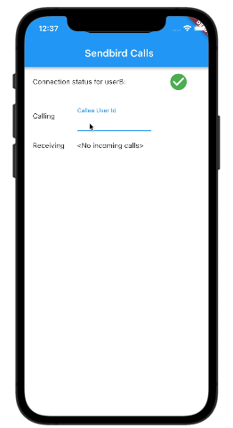

# sendbird_flutter_calls

## Introduction
This sample app demonstrates how to integrate Sendbird's Calls SDK with a Flutter app using [Flutter Platform Channels](https://flutter.dev/docs/development/platform-integration/platform-channels).

 

 

## Requirements
Dependencies for both Android and iOS implementation must be added per instructions for each platform instead of via pubspec.yaml dependency entires:
- [Android instructions](https://sendbird.com/docs/calls/v1/android/getting-started/install-calls-sdk?&utm_source=github&utm_medium=referral&utm_campaign=repo&utm_content=sendbird-calls-flutter-sample)
- [iOS instructions](https://sendbird.com/docs/calls/v1/ios/getting-started/install-calls-sdk?&utm_source=github&utm_medium=referral&utm_campaign=repo&utm_content=sendbird-calls-flutter-sample)

 

## Getting started

This sample consists of the following:

* Passing initializing info from Flutter
* Initializing and connecting to Sendbird in native Android and iOS
* Connecting and disconnecting Sendbird Direct calls

To run:
<tbd>

## Getting Help
Check out the Official calls SDK docs for [Android](https://sendbird.com/docs/calls/v1/android/getting-started/about-calls-sdk?&utm_source=github&utm_medium=referral&utm_campaign=repo&utm_content=sendbird-calls-flutter-sample) and [iOS](https://sendbird.com/docs/uikit/v1/ios/guides/authentication?&utm_source=github&utm_medium=referral&utm_campaign=repo&utm_content=sendbird-calls-flutter-sample)for more information.

If you need any help in resolving any issues, have suggestions or questions, visit our [community forums](https://community.sendbird.com/c/sendbird-chat-uikit/34?&utm_source=github&utm_medium=referral&utm_campaign=repo&utm_content=sendbird-calls-flutter-sample).

 

## We are Hiring!
Sendbird is made up of a diverse group of humble, friendly, and hardworking individuals united by a shared purpose to build the next generation of mobile & social technologies. Join our team remotely or at one of our locations in San Mateo, Seoul, New York, London, and Singapore. More information on a [careers page](https://sendbird.com/careers?&utm_source=github&utm_medium=referral&utm_campaign=repo&utm_content=sendbird-uikit-swift-sample).